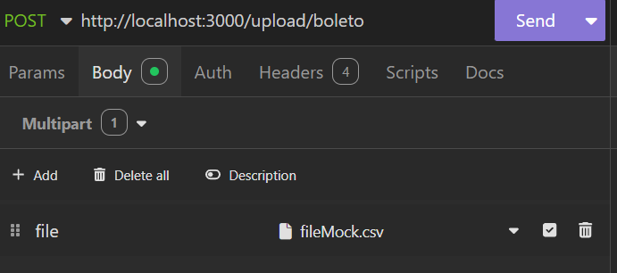

## Projeto bankslip 📑
A partir de um arquivo .csv o sistema deve gerar boletos(salvar no banco de dados).
A ideia do projeto é conseguir lidar com o volume de processamento sem degradar o desempenho. 

O projeto foi desenvolvido em Nodejs utilizando o framework Nestjs. 
Foram utilizados as seguintes ferramentas 🔨: 
- Redis
- Postgres
- Stream 
- RabbitMQ
- Evento de dominio 
- Docker 

## Executar o projeto

```bash 
node v22.13.1
```

```bash
$ yarn install
```

## Iniciar os containers

```bash
$ yarn start:docker
```

## Rodar os testes

```bash
$ yarn test
```

## Processar um arquivo

Enviar o arquivo FormData/multipart via postman/insomnia etc...<br/>
<br />
No diretorio (bankslip\controllers\tests\mock\fileMock.csv) tem um arquivo com 10mil registros que pode ser utilizado para o teste.

## Implementação

- Validação de arquivo repetido: <br />
  É gerado um hash do arquivo e armazenado no redis, antes de processar o arquivo verifico se consta o registro no redis
  Em caso afirmativo retorna um erro e não processa o arquivo.
  Caso ocorra algum erro durante o processamento do arquivo a chave é removida do redis permitindo o upload novamente.

- Validação de registros duplicados: <br />
  Antes de processar/inserir um registro no banco eu verifico no redis se consta uma key (processed: governmentId-debtId)
  Caso exista não processa/insere esse registro.
  Sempre que é feito o processamento insiro essa key no redis a fim de evitar processamento duplicado

- Tratativa de erros: <br />
  O arquivo passa por uma validação, caso encontre algum erro como nome invalido, email invalido etc..., ele armazena esses registros em uma fila DLQ que foi criada de forma intencional. A ideia inicial é trazer visibilidade do que não foi processado permitindo gerar um relatório desses registros e fazer as devidas tratativas.

## RabbitMQ

Verificar o processamento da fila no [Painel](http://localhost:15672/) do rabbitMQ.<br />
Login guest/guest
